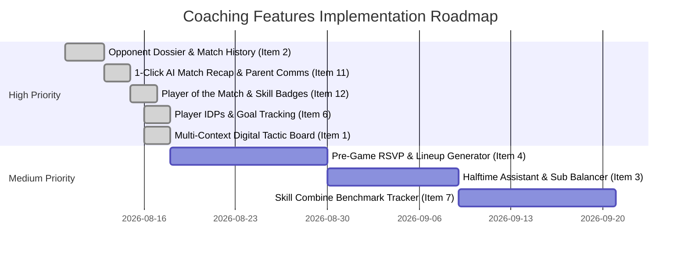

# Apex Team: Next Features & Coaching Enhancements

This document outlines upcoming coaching features and strategic roadmap initiatives for **Apex Team**, categorized and prioritized to maximize coaching impact, player development, and team engagement.

---

## 🎯 Top 5 Priority Roadmap

The following five features are prioritized for immediate planning and implementation based on coaching workflow impact:

```
┌────────────────────────────────────────────────────────────────────────────────────────┐
│                                PRIORITY IMPLEMENTATION QUEUE                           │
├────┬─────────────────────────────┬─────────────────────────────────────────────────────┤
│ #1 │ Opponent Dossier & History  │ ✅ COMPLETED: Dedicated opponent profiles, H2H      │
│    │ (Item 2)                    │ records, tactical notes, and scouting intel.        │
├────┼─────────────────────────────┼─────────────────────────────────────────────────────┤
│ #2 │ AI Post-Match Recap         │ ✅ COMPLETED: 1-click automated parent comms & recap│
│    │ (Item 11)                   │ generator via Gemini 3.6 Flash & match stream.      │
├────┼─────────────────────────────┼─────────────────────────────────────────────────────┤
│ #3 │ "Player of the Match" &     │ ✅ COMPLETED: Positive reinforcement badge system   │
│    │ Skill Badges (Item 12)      │ celebrating effort, defense, and playmaking.        │
├────┼─────────────────────────────┼─────────────────────────────────────────────────────┤
│ #4 │ Multi-Context Tactic Board  │ ✅ COMPLETED: Digital whiteboard & set piece        │
│    │ & Playbook (Item 1)         │ playbook for soccer and volleyball with animations. │
├────┼─────────────────────────────┼─────────────────────────────────────────────────────┤
│ #5 │ Individual Player Goals &   │ ✅ COMPLETED: 1-on-1 goal setting, qualitative    │
│    │ IDP Tracking (Item 6)       │ observations, mastery tracking, and growth cards.   │
└────┴─────────────────────────────┴─────────────────────────────────────────────────────┘
```

---

### Priority 1: Opponent Dossier & Match History (Item 2)
> **Goal:** Provide a dedicated space to store intel, past results, tactical observations, and key player notes about opposing teams.

* **User Story:** *"As a coach preparing for an upcoming match, I want to look up our opponent to see our past head-to-head results, who their dangerous players were, and what tactical adjustments worked against them last time."*
* **Core Capabilities:**
  * **Opponent Entity & Profile:** A dedicated Opponent library linked to a team (or shared across a club/league).
  * **Head-to-Head Record:** Auto-aggregated record against that opponent (Wins / Draws / Losses, Goals For, Goals Against, average clean sheets).
  * **Past Match Reflections & Timeline:** Chronological list of previous encounters with embedded post-game coach notes and event summaries.
  * **Tactical Intel & Danger Tags:**
    * Dangerous player callouts (e.g., *#10 left-footed playmaker*, *tall striker dominant in air*, *vulnerable goalie on high balls*).
    * Opponent tendencies (*"High pressing 3 forwards in 1st half"*, *"Direct long balls on goal kicks"*, *"Aggressive offside trap"*).
  * **Multi-View Integration:**
    * Accessible from Team Navigation (**Opponents** tab).
    * Integrated into the **Pre-Game Lineup Editor** and **Game Summary**.
    * Accessible during match creation/editing in the **Schedule**.

---

### Priority 2: 1-Click AI Match Recap & Parent Communications (Item 11)
> **Goal:** Leverage match events and coaching notes to instantly generate professional, positive post-game updates for parents.

* **User Story:** *"As a coach finishing a busy tournament weekend, I want to generate a positive, well-crafted match recap with one click so parents are informed and players feel recognized without spending an hour drafting emails."*
* **Core Capabilities:**
  * **Smart Event Parsing:** Pulls key match details automatically (opponent name, score, goal scorers, assist providers, clean sheet defenders, milestone playing time).
  * **Customizable Tone & Focus:**
    * *Encouraging / Youth Focus:* Highlights effort, teamwork, resilience, sportsmanship.
    * *Developmental Focus:* Focuses on executing practice themes (e.g., pressing, passing out of the back).
    * *Competitive / Tactical Focus:* Highlights tactical execution, key game moments, and playoff standings.
  * **Channel Formats:** Generates formatted text ready for 1-click copying to Email, SMS, WhatsApp, or Team Chat.
  * **Next Event Reminders:** Automatically attaches the next scheduled practice or game date, time, arrival buffer, and uniform color.

---

### Priority 3: "Player of the Match" & Gamified Skill Badges (Item 12)
> **Goal:** Build positive team culture and athletic confidence by celebrating both scoring and non-scoring contributions.

* **User Story:** *"As a coach, I want to award digital badges and 'Player of the Match' honors after games and practices so all players (not just top goalscorers) feel recognized for hard work, defense, and leadership."*
* **Core Capabilities:**
  * **Award Categories:**
    * 🛡️ *Iron Defender* (Lockdown defending, tackles, clean sheet effort)
    * ⚡ *Relentless Motor* (Highest work rate, pressing, endurance)
    * 🤝 *Ultimate Teammate* (Sportsmanship, positive encouragement, selflessness)
    * 🎯 *Playmaker / Visionary* (Great assists, scanning, tactical awareness)
    * 🌟 *Player of the Match* (Overall standout performance)
    * 📈 *Breakthrough Performance* (Most improved execution of a new skill)
  * **Player Profile Trophy Case:** Badges proudly displayed on the individual player profile with dates and match context.
  * **End-of-Season Printable Certificates:** Exportable PDF certificates for end-of-year team banquets.

---

### Priority 4: Multi-Context Digital Tactic Board & Set Piece Playbook (Item 1)
> **Goal:** A digital whiteboard for tactical diagrams, set-piece routines, and movement explanations across all coaching contexts.

* **User Story:** *"As a coach, I want an interactive tactic board that I can use on my tablet/phone during team talks, practice drill explanations, halftime adjustments, and pre-game match prep."*
* **Core Capabilities:**
  * **Universal Availability:**
    * **Live Game Console:** 1-tap toggle during timeouts or halftime.
    * **Practice Console:** Visualizing drill positioning and scrimmage instructions.
    * **Pre-Game Lineup:** Reviewing set-piece assignments with starting 11.
    * **Standalone Playbook Menu:** Standalone tactical sandbox in the main dashboard.
  * **Interactive Pitch / Court Canvas:**
    * Draggable player tokens with jersey numbers/names and opponent tokens.
    * Drawing tools: pass lines, dribble/run paths, pressing cones, and shaded pitch zones.
  * **Reusable Set-Piece Library:**
    * Pre-save offensive and defensive set pieces (*"Corner Kick - Near Post Flick"*, *"Defensive Free Kick Wall (3-Man)"*, *"Goal Kick Short Option"*).
    * Step-by-step animation or phase progression (Phase 1: Setup → Phase 2: Movement).

---

### Priority 5: Individual Player Development Plans (IDPs) & Goal Tracking (Item 6)
> **Goal:** Enable coaches to set collaborative goals with players, track ongoing observations, and demonstrate clear developmental growth throughout the year.

* **User Story:** *"As a coach, I want to sit down with each player at the start of the season, set 2–3 clear developmental goals, log notes when I see progress in games and practices, and review their growth together throughout the year."*
* **Core Capabilities:**
  * **Goal Setting Framework:**
    * 1–3 target goals per player per season (e.g., *"Improve weak-foot passing accuracy"*, *"Look over shoulder / scan before receiving"*, *"1v1 defensive body positioning"*).
    * Target target timeframe (Pre-season, Mid-season review, End-of-season).
  * **Micro-Note Tagging:**
    * Quick coaching observation log on player profiles: date, event context (practice or game), status indicator (*Emerging*, *Developing*, *Mastered*).
  * **Player & Parent Growth Report:**
    * Clean visual progress timeline showing starting benchmark vs. end-of-season mastery.
    * Printable/exportable 1-page **Player Development Summary Card**.

---

## 📋 Comprehensive Backlog of Additional Coaching Features

The following additional features round out the coaching platform and can be scheduled in subsequent milestones:

---

### Category A: Tactical & In-Game Decision Support

#### #3: Halftime Assistant & Playing Time Rebalancing Advisor
* **Description:** An automated halftime analysis tool inside the Live Game Console.
* **Key Features:**
  * Alerts for players trailing target minutes ($>20\%$ deficit).
  * Fatigue warnings for players who played continuous minutes.
  * Auto-generates a suggested 2nd-half starting rotation to achieve equal-play parity by final whistle.
  * Disciplinary warning for players carrying a yellow card or high foul count.

---

### Category B: Pre-Game Logistics & Availability

#### #4: Player Availability RSVP & Pre-Match Lineup Generator
* **Description:** Pre-game attendance confirmation workflow integrated with lineup builders.
* **Key Features:**
  * Event RSVP status (`Attending`, `Unavailable`, `Tentative`, `No Response`).
  * Unavailable players automatically excluded from starting lineup builders and rotation generators.
  * Saveable Lineup Templates (e.g., *Standard 4-3-3*, *High-Press 3-4-3*, *9v9 Tournament Formation*) that auto-populate based on attending players.

#### #5: Matchday Equipment & Team Checklist
* **Description:** Interactive packing and field-prep checklist for coaches.
* **Key Features:**
  * Checklist items (Match balls inflated, pinnies, first aid kit, ice packs, corner flags, player passcards, medical release forms).
  * Uniform color reminder (Home: Navy / Away: White) based on event schedule.

---

### Category C: Player Development & Long-Term Progression

#### #7: Periodic Skill Combine & Physical Benchmark Tracker
* **Description:** Longitudinal tracking of technical and physical combine tests.
* **Key Features:**
  * Standardized skill tests: Juggling record, 20-yard sprint split, 5-10-5 agility shuttle, passing accuracy drill scores.
  * Testing sessions logged 2–3 times per year (Pre-season, Mid-season, Post-season).
  * Visual progress charts on player profile showing developmental trajectory over time.

#### #8: Position Versatility Matrix & Exploration Tracker
* **Description:** Ensures youth athletes experience diverse positions to promote holistic development.
* **Key Features:**
  * Percentage breakdown of minutes played across positional groups (Defender, Midfielder, Forward, Goalkeeper).
  * Highlights position exposure diversity across the season.

---

### Category D: Practice & Season Planning

#### #9: Season Curriculum & Meso-Cycle Training Progression
* **Description:** Multi-week coaching syllabus connecting practices into cohesive developmental blocks.
* **Key Features:**
  * Define season themes (Weeks 1–3: Building Out from the Back; Weeks 4–6: Transition & Pressing; Weeks 7–9: Attacking in Final Third).
  * Tag drill library entries with curriculum themes.
  * Visual season timeline showing which tactical pillars have been covered.

#### #10: Automated Practice Squad & Scrimmage Balancer
* **Description:** Instant balanced team generator for practice scrimmages and small-sided games.
* **Key Features:**
  * 1-click "Balance Scrimmage" button (Red vs. Blue pinnies).
  * Balances teams by position and skill ratings to ensure competitive practice matches.

---

## 🗺️ Suggested Implementation Roadmap


