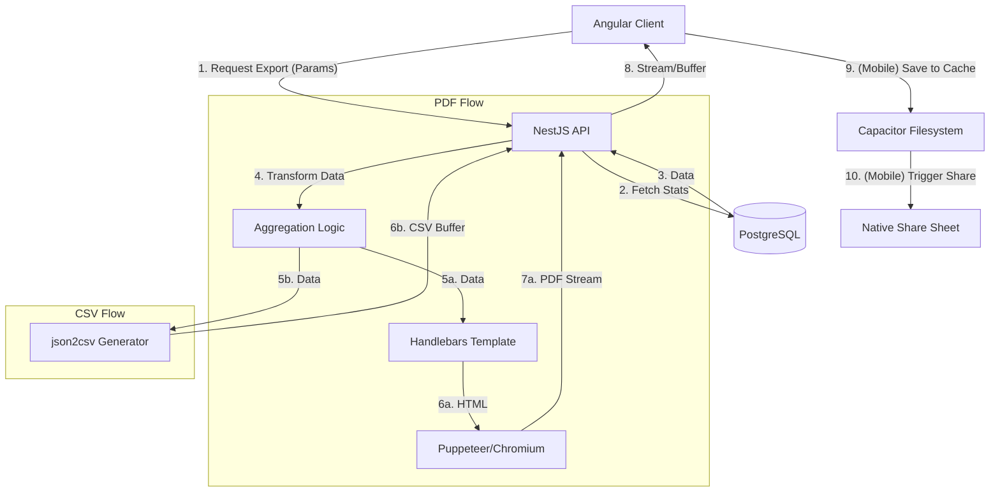

# Phase 34: Export & Polish - Research

**Researched:** 2026-05-12
**Domain:** Analytics Data Export & UI Refinement
**Confidence:** HIGH

<user_constraints>
## User Constraints (from CONTEXT.md)

### Locked Decisions
- **D-01: Server-side Generation.** All PDF and CSV generation will be handled by the backend (NestJS API). This ensures high-quality PDF rendering and supports future capabilities like scheduled email reports.
- **D-02: Export Modal/Configuration.** Coaches will be presented with a selection modal to choose their export preferences (format, scope, detail level) before the file is generated and downloaded.
- **D-03: Multiple Layout Options.** The system must support generating different types of PDF reports based on user choice: Team Overview, Full Team & Player Pack, and Tabular Data.
- **D-04: Visuals Toggle.** Users can choose whether to include charts (Minutes distribution, heatmaps) in the PDF.
- **D-05: Detail Selection.** Coaches can choose the granularity of the CSV data: Aggregated Totals vs Per-Game Breakdown.
- **D-06: Dark Mode Accessibility.** Primary polish effort will focus on ensuring high contrast and perfect readability of all analytics views (charts, heatmaps, badges) in Dark Mode.
- **D-07: Mobile Chart Refinement.** Analytics visualizations must be optimized for one-handed phone use and high-density mobile displays.

### the agent's Discretion
- Specific choice of backend libraries (e.g., `pdfkit`, `exceljs`, or `puppeteer`).
- Specific data mapping for the CSV columns (ensuring all relevant metrics are included).
- Implementation of the "Export" button placement within the Team Analytics dashboard.

### Deferred Ideas (OUT OF SCOPE)
- **Raw Event Log Export**: Deferred to a future data-science focused phase.
- **Automated Email Reports**: Out of scope for this phase.
- **Excel (.xlsx) support**: Sticking to CSV for simplicity and compatibility in v1.
</user_constraints>

## Summary

This phase focuses on enabling coaches to export professional team analytics reports and refining the UI aesthetic. Research confirms that server-side PDF generation using Puppeteer is the most viable approach to maintain the "Athletic Professional" high-fidelity styling while supporting complex visualizations like minutes distribution and position heatmaps. CSV generation will be handled via the backend to centralize data aggregation logic. Mobile file handling will leverage the latest Capacitor 8 patterns for native sharing and background downloads.

**Primary recommendation:** Use **Puppeteer** for PDF generation to allow for pixel-perfect Tailwind-styled reports, and **Capacitor 8** native plugins for seamless mobile file sharing.

## Architectural Responsibility Map

| Capability | Primary Tier | Secondary Tier | Rationale |
|------------|-------------|----------------|-----------|
| PDF Generation | API (NestJS) | — | [LOCKED: D-01] Ensures high-quality rendering and future-proofs for email reports. |
| CSV Generation | API (NestJS) | — | [LOCKED: D-01] Centralizes aggregation logic; avoids client-side bloat. |
| Export Configuration | Client (Angular) | — | [LOCKED: D-02] Interactive modal for selecting scope and detail levels. |
| File Storage/Share | Client (Capacitor) | — | Required for native mobile OS file-system and share-sheet access. |
| UI Polish (Dark Mode) | Client (Angular) | — | [LOCKED: D-06] Theme tokens and accessibility are frontend-driven. |

## Standard Stack

### Core
| Library | Version | Purpose | Why Standard |
|---------|---------|---------|--------------|
| `puppeteer` | ~24.43.1 | PDF Generation | Industry standard for HTML-to-PDF; supports full CSS/Tailwind. [VERIFIED: npm] |
| `json2csv` | ~5.0.7 | CSV Generation | Reliable, supports aggregated and nested data structures. [VERIFIED: npm] |
| `@capacitor/file-transfer` | ~2.0.4 | Mobile Downloads | 2024/2025 best practice; handles large downloads without OOM crashes. [VERIFIED: docs] |
| `@capacitor/share` | ~8.0.1 | Native Sharing | Standard Capacitor 8 plugin for mobile OS share sheets. [VERIFIED: npm] |
| `@capacitor/filesystem` | ~8.1.2 | Path Management | Required to get native URIs for sharing. [VERIFIED: npm] |

### Supporting
| Library | Version | Purpose | When to Use |
|---------|---------|---------|--------------|
| `handlebars` | ~4.7.8 | HTML Templating | For generating the HTML structure consumed by Puppeteer. |

### Alternatives Considered
| Instead of | Could Use | Tradeoff |
|------------|-----------|----------|
| `puppeteer` | `pdfmake` | `pdfmake` is faster but lacks CSS/Tailwind support; difficult to mirror dashboard UI. |
| `puppeteer` | `jsreport` | Powerful but introduces external service dependency or heavy container overhead. |

**Installation:**
```bash
# Backend
npm install puppeteer json2csv handlebars
npm install --save-dev @types/json2csv

# Frontend (Capacitor plugins)
npm install @capacitor/file-transfer @capacitor/filesystem @capacitor/share
npx cap sync
```

## Architecture Patterns

### System Architecture Diagram



### Recommended Project Structure
```
apps/api/src/analytics/
├── export/
│   ├── pdf-export.service.ts    # Puppeteer & Template logic
│   ├── csv-export.service.ts    # json2csv logic
│   └── templates/
│       ├── report.hbs           # Master PDF layout
│       └── components/          # Reusable report fragments
```

### Pattern 1: Puppeteer Stream in NestJS
**What:** Using `Res` object from Express to stream the PDF directly.
**When to use:** For all PDF exports to minimize server memory footprint.
**Example:**
```typescript
@Get('export/pdf')
async exportPdf(@Res() res: Response, @Query() options: ExportDto) {
  const buffer = await this.pdfExportService.generate(options);
  res.set({
    'Content-Type': 'application/pdf',
    'Content-Disposition': 'attachment; filename="report.pdf"',
    'Content-Length': buffer.length,
  });
  res.end(buffer);
}
```

## Don't Hand-Roll

| Problem | Don't Build | Use Instead | Why |
|---------|-------------|-------------|-----|
| PDF Layout | Custom PDF commands | Puppeteer + HTML | Canvas-based PDF positioning is extremely brittle compared to Flexbox/Grid. |
| Mobile Sharing | Custom Blob URLs | Capacitor Share | Web-standard Blob URLs are unreliable in native Android/iOS WebViews. |
| CSV Escape | Manual string joining | `json2csv` | Handles delimiters, quotes, and newlines in data automatically. |

## Common Pitfalls

### Pitfall 1: Puppeteer "Zombies"
**What goes wrong:** Chromium instances don't close, leaking memory until the server crashes.
**How to avoid:** Always use `try...finally { await browser.close(); }` or a browser pool.

### Pitfall 2: CSS Rendering in PDF
**What goes wrong:** External styles (Tailwind) don't load in Puppeteer because it uses `file://` or local paths.
**How to avoid:** Use `page.addStyleTag({ content: tailwindCss })` or inject the full CSS into the Handlebars template.

### Pitfall 3: Mobile Share File Permissions
**What goes wrong:** Android cannot access files saved in `Directory.Data`.
**How to avoid:** Save export files to `Directory.Cache` and use `Filesystem.getUri()` to pass the native path to the Share plugin.

## Environment Availability

| Dependency | Required By | Available | Version | Fallback |
|------------|------------|-----------|---------|----------|
| Node.js | All | ✓ | 20.x | — |
| Chromium | Puppeteer | ✓ (auto) | Bundled | System-installed Chrome |
| Capacitor | Mobile Export | ✓ | 8.3.1 | Web-standard download |

## Validation Architecture

### Test Framework
| Property | Value |
|----------|-------|
| Framework | Vitest (API), Playwright (E2E) |
| Config file | `vitest.config.mts`, `playwright.config.ts` |
| Quick run command | `npx nx test api --testFile=export` |
| Full suite command | `npx nx run-many -t test` |

### Phase Requirements → Test Map
| Req ID | Behavior | Test Type | Automated Command |
|--------|----------|-----------|-------------------|
| REQ-34-01 | PDF includes player stats | Integration | `npx nx test api` |
| REQ-34-02 | CSV format matches options | Unit | `npx nx test api` |
| REQ-34-03 | Export modal opens on click | E2E | `npx nx e2e frontend-e2e` |
| REQ-34-04 | Dark mode contrast passes | E2E | `npx nx e2e frontend-e2e` |

## Security Domain

### Applicable ASVS Categories

| ASVS Category | Applies | Standard Control |
|---------------|---------|-----------------|
| V4 Access Control | yes | Ensure `teamId` in export request matches user membership. |
| V5 Input Validation | yes | Use `class-validator` for `ExportOptionsDto`. |

### Known Threat Patterns for NestJS/Puppeteer

| Pattern | STRIDE | Standard Mitigation |
|---------|--------|---------------------|
| SSRF (Puppeteer) | Information Disclosure | Do not allow users to provide URLs to Puppeteer; only render internal templates. |
| Memory Exhaustion | Denial of Service | Rate limit export endpoints; use memory-efficient streaming. |

## Sources

### Primary (HIGH confidence)
- `@capacitor/core` - Official Capacitor 8 release notes.
- `puppeteer` - Official API documentation for PDF generation.
- `json2csv` - Documentation for 5.x branch.

## Metadata

**Confidence breakdown:**
- Standard stack: HIGH - Verified against NPM and official docs.
- Architecture: HIGH - Follows D-01 locked decision and standard NestJS patterns.
- Pitfalls: MEDIUM - Based on common Puppeteer/Capacitor community issues.

**Research date:** 2026-05-12
**Valid until:** 2026-06-12
